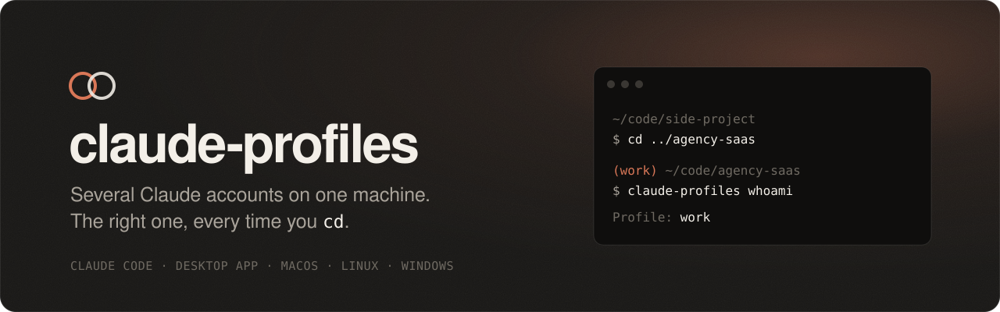

<p align="center">
  <a href="https://inevitable-lettus.github.io/claude-profiles/"></a>
</p>

<p align="center">
  <a href="https://github.com/inevitable-lettus/claude-profiles/releases/latest"></a>
  <a href="https://github.com/inevitable-lettus/claude-profiles/actions/workflows/ci.yml"></a>
  
  <a href="LICENSE"></a>
</p>

<p align="center">
  <a href="https://inevitable-lettus.github.io/claude-profiles/">Website</a> ·
  <a href="#install">Install</a> ·
  <a href="#quick-start">Quick start</a> ·
  <a href="docs/">Docs</a> ·
  <a href="CHANGELOG.md">Changelog</a>
</p>

---

You have a personal Claude account and one from work, or two clients who
should never share history. Claude Code has one login per machine, so you
log out, log in, and eventually run the wrong one in the wrong repo.

**claude-profiles** gives each account an isolated profile, for Claude Code
*and* the desktop app, and switches automatically when you `cd` into a
project.

- **Per-directory switching.** Drop a one-line `.claude-profile` in a repo.
  Plain `claude` runs as the right account there. No prefix to remember.
- **Desktop app, side by side.** Two instances with separate logins, MCP
  servers and window state, each with a clickable launcher.
- **`doctor`.** One command that tells you what an update broke, what
  outranks your profile credential, and which MCP ports collide.
- **Readable and conservative.** Bash and PowerShell, no daemon, no binary.
  Never touches `~/.claude`, never edits your shell rc, never prints a secret.

<p align="center">
  
</p>

> Not affiliated with Anthropic. This drives documented environment variables
> and an Electron command-line flag; none of it is a supported API. See
> [Known limitations](#known-limitations).

---

## Install

**macOS / Linux**

```bash
curl -fsSL https://raw.githubusercontent.com/inevitable-lettus/claude-profiles/main/install.sh | sh
```

**Windows (PowerShell 5.1 or 7+)**

```powershell
irm https://raw.githubusercontent.com/inevitable-lettus/claude-profiles/main/install.ps1 | iex
```

Both install the **latest release** into your home directory and link the
command onto your PATH. Neither edits your shell configuration, creates a
profile, reads a credential or needs admin rights. Run the same line again to
update. `CLAUDE_PROFILES_BRANCH=main` tracks the development head instead, and
`CLAUDE_PROFILES_BRANCH=v1.0.0` pins a version.

Requirements: `git`, and bash 3.2+ (what macOS ships) or PowerShell.

## Quick start

```bash
# 1. hook your shell (or: claude-profiles shell-init bash | pwsh)
echo 'eval "$(claude-profiles shell-init zsh)"' >> ~/.zshrc && exec zsh

# 2. register a second account and log in to it once
claude-profiles init
claude-profiles add work
claude-profiles run work -- /login

# 3. pin a project to it
cd ~/code/agency-saas
claude-profiles use work        # writes .claude-profile

claude-profiles doctor          # is any of it broken?
```

Your existing login is untouched and stays the **primary** account. After
setup:

```bash
claude                    # primary, or whatever .claude-profile says here
claude-work               # the work account, from anywhere
cd ~/code/side-project    # back to primary, automatically
```

---

## How it works

Two separate problems: the CLI and the desktop app.

### The CLI half

`CLAUDE_CONFIG_DIR` points Claude Code at a different config directory.
That separates settings, history, projects and sessions everywhere, and it
separates the **login** too:

| | Where a profile's login lives |
|---|---|
| **macOS** | Keychain item `Claude Code-credentials-<hash of the config dir>` |
| **Linux** | `<config dir>/.credentials.json` |
| **Windows** | `<config dir>\.credentials.json` |

So every profile is `/login` once and done. `doctor` checks that each
profile's login is where it should be.

The macOS naming is observed behaviour of current Claude Code, not a
documented contract. Older builds kept every Mac login in one Keychain item,
and for those (and for CI) there is token auth:
`claude-profiles add <name> --auth oauth-token`. It costs Remote Control and
claude.ai connectors, and the token expires after a year.
[docs/macos.md](docs/macos.md) has the detail.

### The desktop half

Electron's `--user-data-dir` points an instance at its own directory.
Everything it stores (credential blob, MCP config, window state, caches)
lands there, so two directories are two independent instances.

| | Difficulty | Why |
|---|---|---|
| **macOS** | Usually fine | The credential *might* live in one fixed Keychain slot. [One manual test](#the-one-test-that-matters) decides. |
| **Linux** | Fine | The encrypted blob lives inside the user-data directory. Profiles cannot collide. |
| **Windows** | Depends on how you installed it | A direct `.exe` install works immediately. An **MSIX / Microsoft Store** install cannot be launched with arguments at all. See [docs/windows.md](docs/windows.md). |

---

## The one test that matters

macOS desktop only, and `doctor` prints it:

1. Launch Claude normally. Confirm you are **account A**. Quit with Cmd+Q;
   closing the window is not enough.
2. Run `claude-profiles desktop work`. Log in as **account B**. Quit with Cmd+Q.
3. Launch Claude normally again.
4. **Which account are you in?**

Still A: it works, you're done. Now B, or logged out: the two profiles share
one Keychain slot, and you need `claude-profiles mirror-app work`.

**Step 4 is the whole test.** It is easy to stop after step 2, see account B
working, and declare victory. Then a week later account A logs out and you
have no idea why.

---

## Commands

```
SETUP
  init                          create the registry; adopt an existing setup
  add <name> [options]          register a profile
  remove <name>                 unregister (asks about each piece of data)
  list [--json]                 show every profile

USING A PROFILE
  run <name> [-- args...]       run Claude Code as that profile
  shell <name>                  subshell where plain 'claude' is that profile
  desktop <name>                launch the desktop app on that profile
  whoami                        which profile is this shell on?

WORKFLOW
  use <name>                    write .claude-profile here
  prompt                        active profile, for a prompt or statusline
  shell-init <zsh|bash|pwsh>    the line for your shell rc

MAINTENANCE
  doctor [<name>] [--json] [--probe]    health check
  token refresh <name>          new OAuth token (token-auth profiles)
  install-launcher <name>       clickable launcher for a desktop profile
  mirror-app <name>             escape hatch — read 'doctor' first
  mcp-config <name>             path to that profile's MCP template
  uninstall                     remove everything, asking about each item
```

On Windows the same subcommands work, and there are Verb-Noun cmdlets
(`Add-ClaudeProfile`, `Invoke-ClaudeProfileDoctor`, …) for people who prefer
them. See [docs/windows.md](docs/windows.md).

---

## Workflow integration

**Per-directory switching.** A one-line `.claude-profile` file. The walk up
the tree and the name check happen in pure shell, so a directory without one
costs a few `stat` calls and launches no processes.

**Prompt indicator.** The integration exports `CLAUDE_ACTIVE_PROFILE`:

```bash
PROMPT='${CLAUDE_ACTIVE_PROFILE:+($CLAUDE_ACTIVE_PROFILE) }'$PROMPT
```

For starship, oh-my-posh, or Claude Code's own `statusLine`, run
`claude-profiles prompt --help`.

**Per-profile MCP config.** Each profile owns a `claude_desktop_config.json`
template, applied on launch. Without this, two instances spawn duplicate
servers and any server binding a fixed port fails in whichever starts second.
`doctor` flags port collisions before you hit them.

**direnv**, if you already use it: see [shell/envrc.example](shell/envrc.example).

**CI / scripts.** `claude-profiles run <name> -- -p "..."` is non-interactive
and exits with the child's status.

---

## Is `.claude-profile` safe in a repo I cloned?

Yes, and the design assumes it is hostile.

The file may **only select a profile that is already registered on your
machine, by name**. It cannot create a profile, name a directory, name a
token, pass a flag, or cause a login. Its entire vocabulary is the set of
names you already chose.

The permitted character set — lowercase, digits, hyphen, underscore — is
checked in pure shell *before* the name reaches any subprocess, and again by
`claude-profiles` itself. A name you do not have warns and leaves you on your
primary account; it never falls through to a different profile, because that
is exactly the failure the feature exists to prevent.

The file contains no secret. It is still worth adding to `.gitignore` unless
your whole team shares the profile name.

---

## Where things live

```
~/.config/claude-profiles/profiles.json    the registry — one source of truth
~/.config/claude-profiles/profiles/<name>/ per-profile MCP template
~/.claude-<name>/                          that profile's CLI config dir
~/.claude/                                 your PRIMARY account. Never touched.
```

On Windows, `%APPDATA%\claude-profiles\` and `%USERPROFILE%\.claude-<name>\`.

The registry is the reason this is one tool rather than a pile of scripts with
the same constants copy-pasted into three files. Everything — the bash
implementation, the PowerShell module, the generated shell integration — reads
it. `tests/registry-contract.sh` checks that both implementations serialise it
byte for byte identically.

---

## Repo layout

```
bin/claude-profiles              entrypoint — macOS and Linux
lib/                             the implementation, one concern per file
  platform.sh                    what differs between the three platforms
  registry.sh                    the profile registry
  cli.sh                         Claude Code half, and the two auth modes
  desktop.sh                     desktop half, and the --user-data-dir trick
  workflow.sh                    per-directory switching, shell integration
  doctor.sh                      every health check
  secrets.sh                     Keychain / DPAPI / libsecret / file
  json.awk                       a JSON parser, so there is no jq dependency
powershell/ClaudeProfiles/       the Windows implementation
schema/profiles.schema.json      the contract both implementations satisfy
tests/                           smoke test, contract test, Pester suite
docs/                            per-platform detail and design notes
site/                            the project website (GitHub Pages)
assets/                          README artwork
```

The comments are the documentation. If something here looks arbitrary, the
file it lives in explains why.

---

## Tests

```bash
./tests/smoke-test.sh          # bash implementation, fake OS in /tmp
./tests/registry-contract.sh   # bash vs PowerShell, byte for byte
```

The smoke test runs against stubbed `security`, `defaults`, `codesign`, `open`
and friends in a throwaway sandbox. No real app is launched, no real Keychain
is read or written, no real `HOME` is modified. It also flips the `uname` stub
to check that Linux takes the genuinely different path it should.

What tests **cannot** tell you: whether the real Claude app honours
`--user-data-dir`, or where it stores credentials. Only
`claude-profiles doctor --probe` plus [the manual test](#the-one-test-that-matters),
on your actual machine, answer those.

---

## Troubleshooting

**`claude-work` runs as the wrong account anyway.**
Something higher in the credential precedence is winning, like a stray
`ANTHROPIC_API_KEY`. `claude-profiles doctor` checks all of it,
including `apiKeyHelper`, which lives in a settings file rather than the
environment and is easy to forget.

**Second desktop instance doesn't open, or just focuses the existing window.**
Quit Claude fully first (Cmd+Q). On macOS, `doctor` also checks whether the
app sets `LSMultipleInstancesProhibited`.

**Primary account gets logged out after using the secondary.** (macOS)
In the desktop app: the Keychain collision, `claude-profiles mirror-app <name>`.
In the CLI: your Claude Code predates per-directory Keychain items. Update it,
or use `--auth oauth-token` for that profile.

**On Windows, nothing launches with a separate profile.**
Almost certainly an MSIX install. `Invoke-ClaudeProfileDoctor` will say so.
[docs/windows.md](docs/windows.md).

**MCP servers fail in the second instance.**
Each instance spawns its own copy of every configured server. Give the two
profiles different MCP configs — `claude-profiles mcp-config <name>` prints
the path to edit.

**Everything broke after a Claude update.**
Expected — this is unsupported behaviour, not an API. `claude-profiles doctor`
exists so the answer to "what changed?" takes one command.

More in [docs/troubleshooting.md](docs/troubleshooting.md).

---

## Known limitations

- On macOS both desktop instances share one dock icon and one Cmd+Tab entry,
  because they are the same application. The launcher gives you a separate way
  to *start* the second instance, not a separate app identity. Same on the
  Windows taskbar.
- A mirrored app (`mirror-app`) never auto-updates. Re-run it after each
  Claude update; `doctor` reports how far behind it is.
- On Windows, `claude://` links always open the original install, never a
  mirror.
- All of this drives documented environment variables and an Electron flag.
  None of it is a supported API, and an update can invalidate any of it.

---

## Contributing

See [CONTRIBUTING.md](CONTRIBUTING.md). The short version: keep the comment
density, run both test scripts, and if you touch the registry format, update
`schema/profiles.schema.json` and **both** implementations — the contract test
will fail if you don't.

Security issues: [SECURITY.md](SECURITY.md).

---

## What it will not do

Two accounts for two genuinely separate contexts — personal and an agency,
say, or a personal account and one your employer provides — is ordinary, and
it is what this exists for.

Rotating between accounts to get around usage limits is a different thing, and
it is the kind of behaviour Anthropic's usage policy covers. This tool will not
help you do it: it has no scheduling, no automatic failover, and no way to
switch on a rate-limit error. Worth being clear with yourself about which one
you are doing before building a workflow on it.

---

## Licence

MIT. See [LICENSE](LICENSE).
